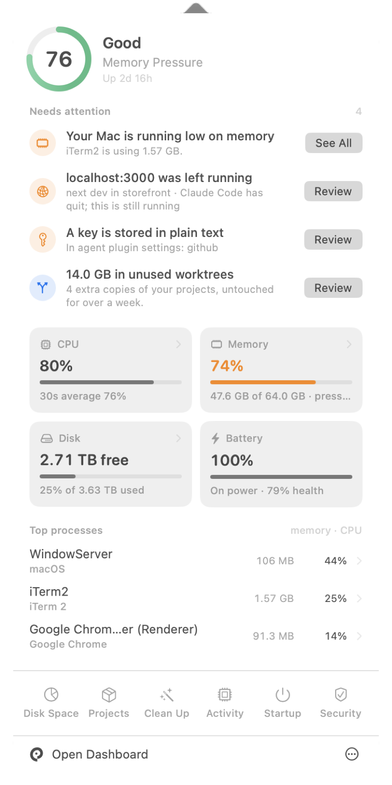
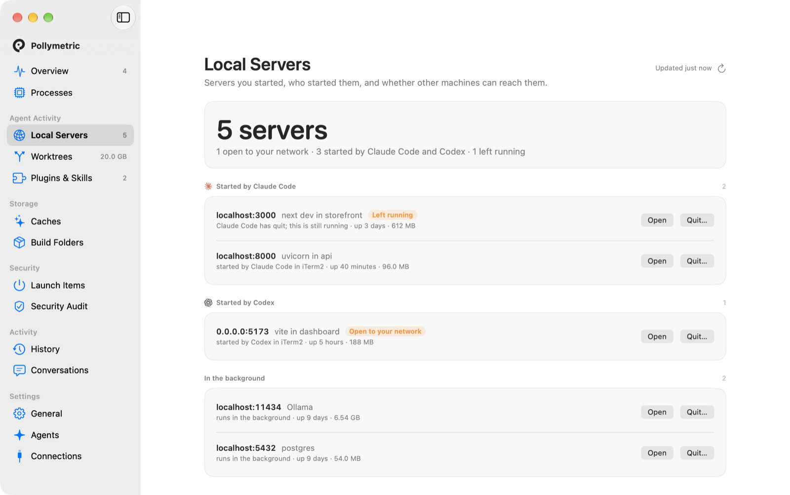
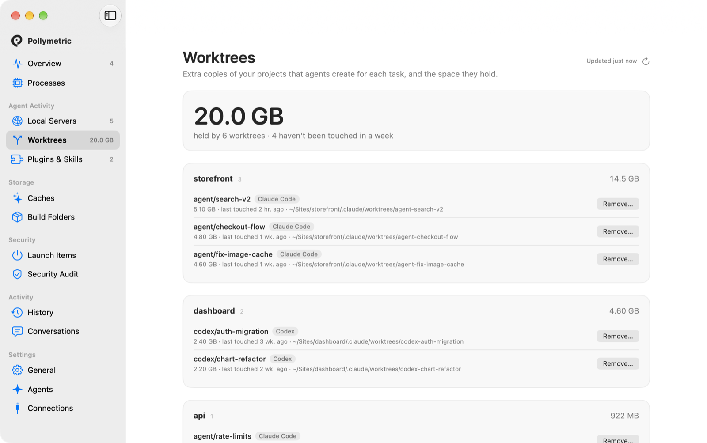
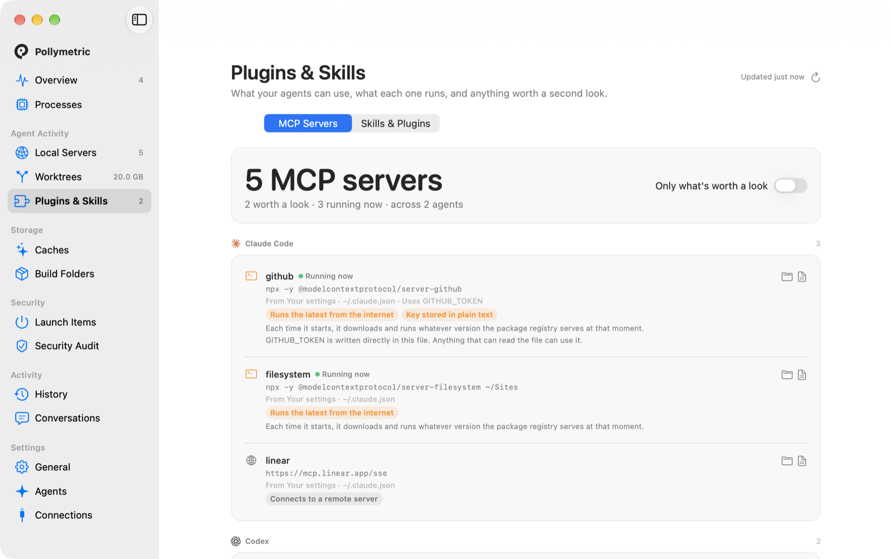
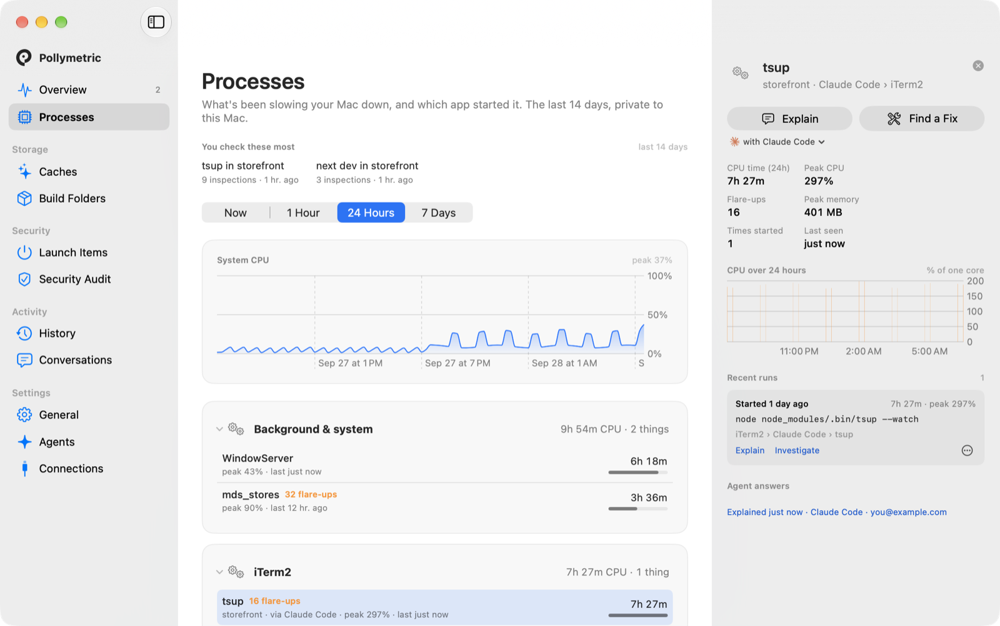
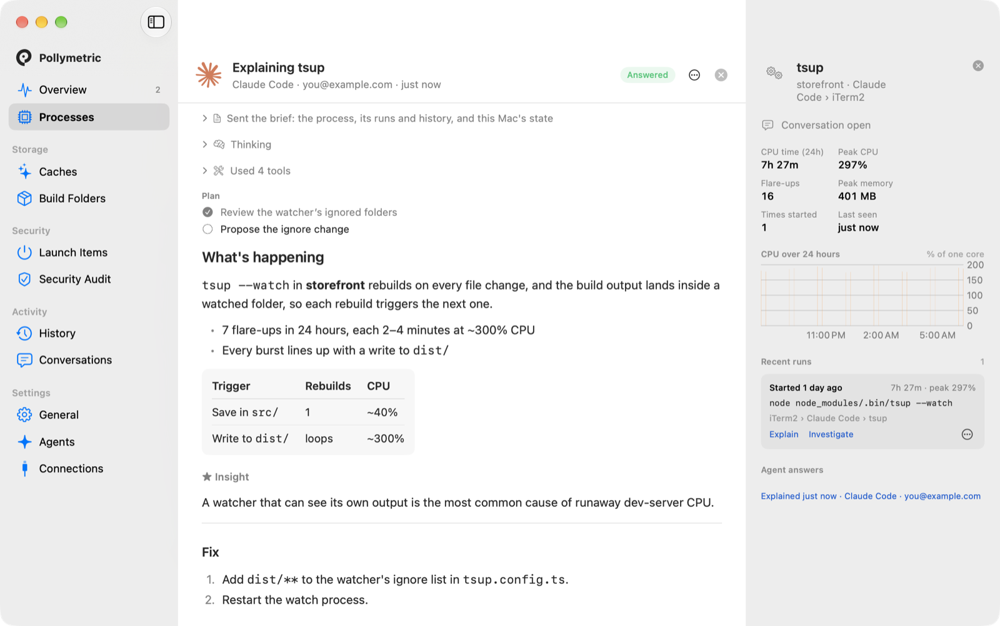
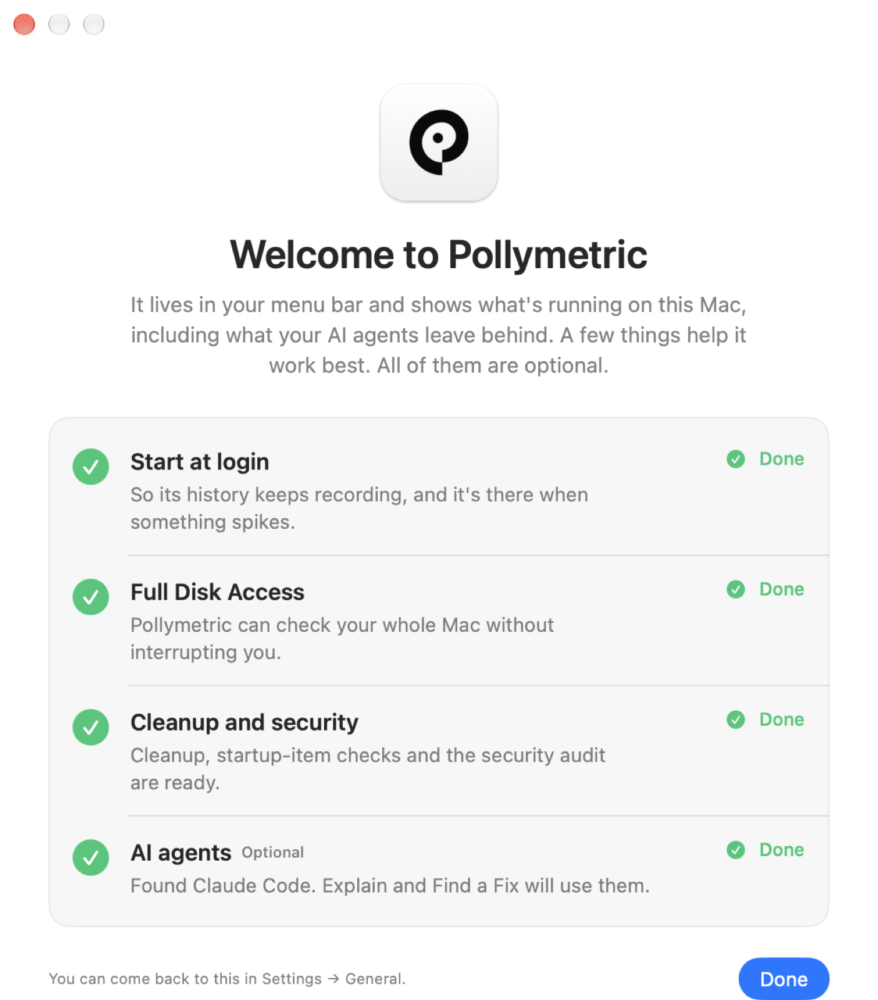

  

<h1 align="center">Pollymetric</h1>

<strong>See what your AI agents are doing to your Mac.</strong> 
What's running, who started it, what it's costing you, and what got left behind. Right in your menu bar.

  
  
  
  

  <a href="https://pollymetric.com"><strong>pollymetric.com</strong></a>

  

## Why it exists

AI agents now do real work on your Mac: they start dev servers and watchers, make a fresh copy of your
project for each task, load local models and install plugins. They rarely clean up after themselves,
and your Mac pays for it in battery, memory and disk. None of it is labelled. Your Mac just says
"node".

Pollymetric shows you what's going on, and what got left behind.

## What it does for you

**Find the servers nobody stopped.**
Every server running on your Mac, which agent or app started it, how long it's been up, and whether
other machines on your network can reach it. When the agent that started one has quit, Pollymetric
remembers who it was and flags it as left running.

  

**Get your disk back from forgotten project copies.**
Agents make a copy of your project for each task, each with its own dependencies and builds. See
every copy, how much space it holds, when it was last touched and which agent made it, and remove the
ones you don't need. Your branches stay, and anything unsaved gets a clear warning first.

  

**Know what your agents have been given.**
The plugins and skills each agent can use, what each one runs, and anything worth a second look: tools
that run whatever a registry serves that day, and keys stored in plain text.

  

**See what's really using your memory.**
A local model holding gigabytes shows up by the model it has loaded, not "ollama". Every process is
named by what it is and who started it: *"next dev in storefront, started by Claude Code in iTerm2."*

**Catch the problem that keeps coming back.**
Pollymetric remembers the last two weeks. Something that spikes for twenty seconds and vanishes is
still on the record, and anything that keeps flaring up gets flagged, with how often and how much.

  

**Let an agent help clean up after agents.**
Click **Explain** or **Find a Fix** and your own AI agent (Claude Code, Codex and others) investigates
right beside the process and tells you what's going on and how to fix it. It can't change anything
without your okay, one step at a time. You don't need an agent for anything else.

  

**Everyday upkeep, too.**
Free up space from caches and old build folders, see everything that starts when you log in (with
unknown developers flagged), and check how well your Mac is protected. Nothing is removed until you
confirm.

**Let your agents check in, on your terms.**
Connect an agent and it can ask Pollymetric how your Mac is doing. You approve each agent with
Touch ID, see what it looked at, and can revoke it any time. Anything that would change your Mac asks
you first, every time.

## Private by design

Everything Pollymetric records is stored on your Mac. There's no account, no cloud and no tracking.
When you use Explain or Find a Fix, only the relevant context goes to the agent you chose. It uses less
than 1% CPU at idle.

## Install

1. [**Download Pollymetric.dmg**](https://github.com/pouyanafisi/pollymetric/releases/latest/download/Pollymetric.dmg) (or browse [all releases](https://github.com/pouyanafisi/pollymetric/releases)).
2. Open it and drag Pollymetric into **Applications**.
3. Open Pollymetric. A short setup lets you choose what to enable: start at login, the one permission
   that lets it check your whole Mac, the extra cleanup and security tools (installed for you), and any
   AI agents it found.

> **Early release:** this version isn't notarized by Apple yet, so the first time you open it macOS will
> say it can't verify the developer. Open **System Settings → Privacy & Security** and click
> **Open Anyway**.

  

Works on macOS 14 Sonoma or later, on Apple silicon and Intel Macs.

To remove it: **Settings → General → Uninstall**, with the option to delete everything it recorded.

## Why "Pollymetric"?

Polly, as in the parrot AI gets compared to. Metric, as in measure. Pollymetric keeps count of what the
parrots are doing to your machine.

---

Building Pollymetric yourself? See [docs/DEVELOPMENT.md](docs/DEVELOPMENT.md).
